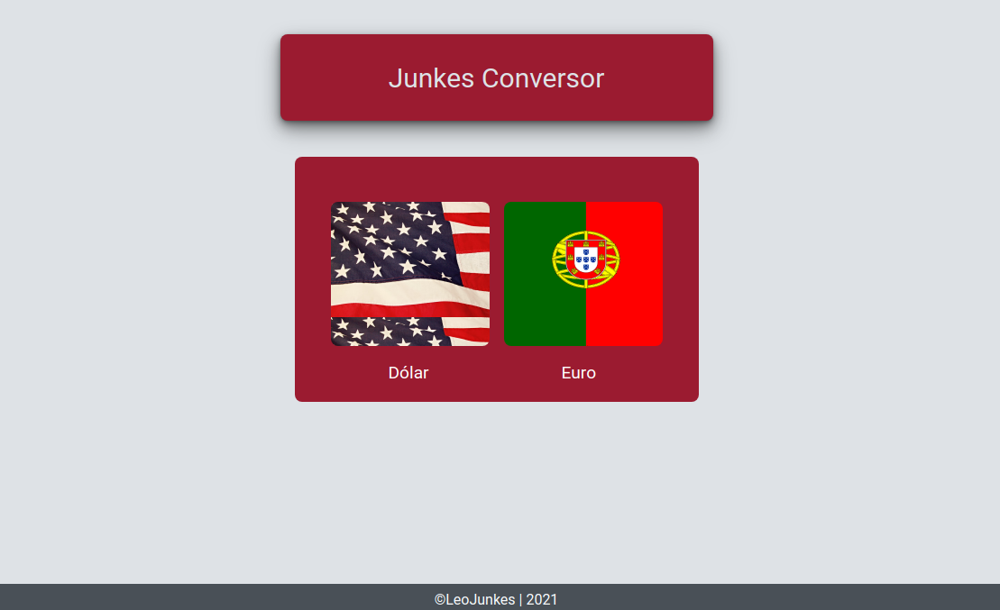
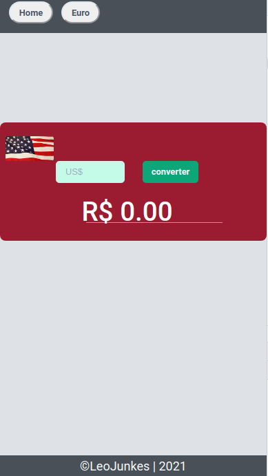
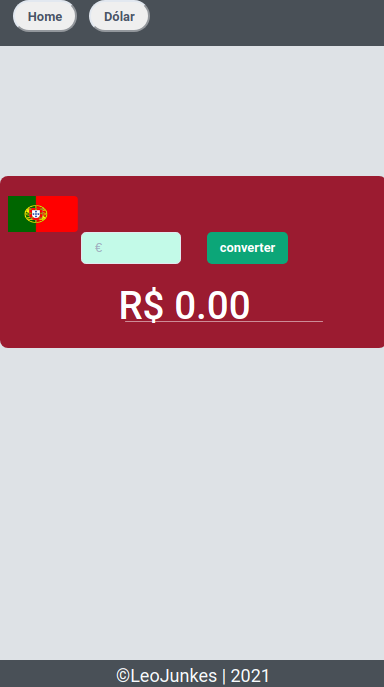

# Junkes Conversor

## Preview





## Tecnologias utilizadas no projeto


## Sobre

Um conversor de moedas, simples e funcional, colocando em prática o que foi aprendido.

## Instalação

Clone o repositório com ```git clone https://github.com/Leojunkes/conversor_next```

entre na pasta ```cd conversor_next```

rode ```npm install```ou```yarn```para instalar as dependências.

e por fim rode ```yarn dev```ou ```npm run dev```

abra http://localhost:3000 com seu browser.
